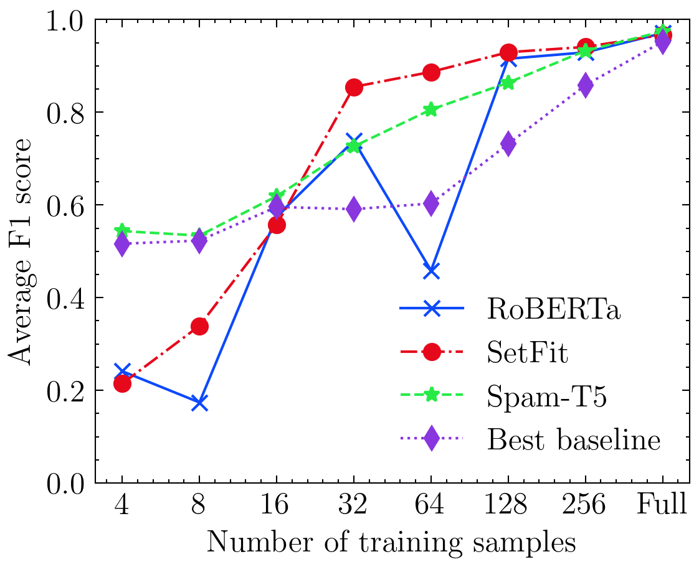

# Spam-T5: Benchmarking Large Language Models for Few-Shot Email Spam Detection

*by Maxime Labonne and Sean Moran*

This paper has been submitted for publication in [ECML PKDD 2023](https://2023.ecmlpkdd.org/) and is available on [arXiv](https://arxiv.org/pdf/2304.01238.pdf).

It evaluates different baseline techniques and large language models for email spam detection. It also introduces **Spam-T5**, a modified [Flan-T5](https://huggingface.co/google/flan-t5-base) model which significantly outperforms other models.



### Abstract

This paper investigates the effectiveness of large language models (LLMs) in email spam detection by comparing prominent models from three distinct families: BERT-like, Sentence Transformers, and Seq2Seq. Additionally, we examine well-established machine learning techniques for spam detection, such as Naïve Bayes and LightGBM, as baseline methods. We assess the performance of these models across four public datasets, utilizing different numbers of training samples (full training set and few-shot settings). Our findings reveal that, in the majority of cases, LLMs surpass the performance of the popular baseline techniques, particularly in few-shot scenarios. This adaptability renders LLMs uniquely suited to spam detection tasks, where labeled samples are limited in number and models require frequent updates. Additionally, we introduce Spam-T5, a Flan-T5 model that has been specifically adapted and fine-tuned for the purpose of detecting email spam. Our results demonstrate that Spam-T5 surpasses baseline models and other LLMs in the majority of scenarios, particularly when there are a limited number of training samples available.

### Installation

All Python packages needed are listed in [requirements.txt](requirements.txt). You can install them with the following commands:

    git clone https://github.com/jpmorganchase/llm-email-spam-detection.git
    cd llm-email-spam-detection
    python -m venv venv
    source venv/bin/activate
    pip install -r requirements.txt --extra-index-url https://download.pytorch.org/whl/cu116

### Usage

All source code used to generate the results and figures in the paper are in the `src` folder. The data used in this paper is automatically downloaded, processed, and stored in the `data` folder.

You can start training the 6 baseline techniques and 3 large language models with the following command:

    python main.py

### Maintenance Level

This repository is maintained to fix bugs and ensure the stability of the existing codebase. However, please note that the team does not plan to introduce new features or enhancements in the future.

### Reference

If you re-use this work, please cite:

```
@misc{labonne2023spamt5,
      title={Spam-T5: Benchmarking Large Language Models for Few-Shot Email Spam Detection}, 
      author={Maxime Labonne and Sean Moran},
      year={2023},
      eprint={2304.01238},
      archivePrefix={arXiv},
      primaryClass={cs.CL}
}
```
